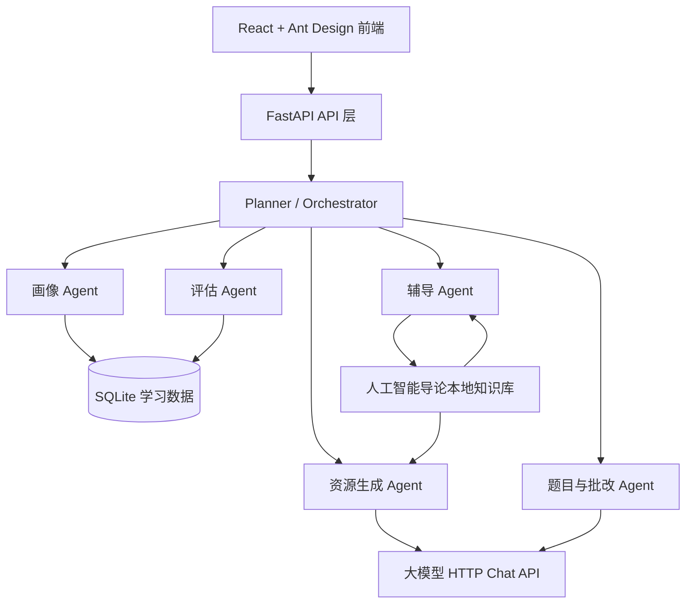
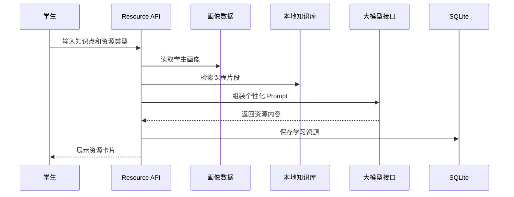
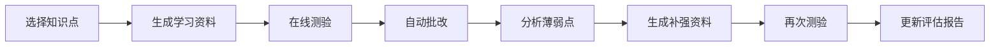

# 智学通 EduAgent 系统架构设计文档

## 1. 项目定位

**项目名称：** 智学通 EduAgent

**参赛方向：** 第十五届“中国软件杯”A3 - 基于大模型的个性化资源生成与学习多智能体系统开发

**示范课程：** 人工智能导论

智学通不是单一聊天机器人，而是围绕“了解学生 - 生成资源 - 规划路径 - 在线测评 - 错因补强 - 效果评估”的个性化学习闭环系统。系统通过对话和学习行为构建动态学生画像，由多智能体协同生成学习资源、推荐学习路径，并持续沉淀可解释的学习证据。

## 2. A3 赛题对齐

| 赛题能力点 | 当前实现 | 可演示入口 |
| --- | --- | --- |
| 动态学生画像 | 支持 7 维画像：知识基础、认知风格、学习能力、易错点、学习目标、兴趣方向、学习习惯 | `/profile` |
| 多智能体协同 | Planner/Orchestrator 调度画像、资源、题目、辅导、评估等 Agent | `/dashboard`、`/chat` |
| 个性化资源生成 | 支持课程讲解、思维导图、练习题、拓展阅读、代码案例 5 类资源 | `/resources` |
| 学习路径规划 | 结合画像、薄弱点、测验记录和知识图谱生成推荐路径 | `/path` |
| 学习效果评估 | 汇总画像、资源、测验、学习时长和补强记录生成评估报告 | `/evaluation` |
| 可验证闭环 | 演示数据可展示“72 分测评 - 补强学习 - 88 分再测”的提升证据 | `/learning`、`/evaluation` |

## 3. 总体架构



系统采用前后端分离架构：

- 前端负责竞赛驾驶舱、对话、画像、资源、学习路径、自适应学习和评估报告展示。
- 后端负责 API、数据库、知识库加载、LLM 调用、多 Agent 编排和演示数据准备。
- SQLite 用于沉淀画像、资源、对话和学习记录，保证评估报告有真实数据来源。
- Mermaid 在前端以本地依赖渲染，减少比赛现场网络波动影响。

## 4. 技术选型

### 4.1 后端

| 技术 | 作用 |
| --- | --- |
| Python + FastAPI | API 服务、异步接口、Swagger 文档 |
| SQLAlchemy + aiosqlite | 学生画像、资源、对话、学习记录持久化 |
| httpx | 调用 OpenAI-compatible HTTP Chat API |
| pydantic-settings | 环境变量和模型配置管理 |
| LangChain / ChromaDB | 已纳入依赖，作为后续向量化 RAG 扩展基础 |
| 本地 Markdown 知识库 | 人工智能导论课程内容检索与生成约束 |

### 4.2 前端

| 技术 | 作用 |
| --- | --- |
| React 18 + TypeScript | 单页应用与类型约束 |
| Vite | 开发服务与构建 |
| Ant Design 5 | 中文后台式交互组件 |
| React Router | 页面路由 |
| Mermaid | 思维导图、知识图谱、流程图渲染 |
| Recharts | 画像和评估指标可视化 |
| Axios | API 请求封装 |

## 5. 核心模块

### 5.1 竞赛驾驶舱

入口：`/dashboard`

驾驶舱用于第一屏证明作品与 A3 赛题高度对齐，展示：

- 画像维度覆盖度
- 资源数量与资源类型
- 知识图谱节点规模
- 多智能体协作链路
- 答辩演示路线
- 一键准备演示数据

### 5.2 动态学生画像

入口：`/profile`

画像模块维护 7 个维度，每个维度包含内容、置信度和更新时间。画像不仅用于展示，还会被资源生成、路径推荐和评估报告复用。

画像来源包括：

- 对话中抽取的学生背景、目标和偏好
- 学习资源使用记录
- 在线测验和错因分析
- 演示数据种子中的标准闭环样例

### 5.3 多智能体编排

后端 Agent 位于 `backend/app/agents`。

| Agent | 职责 |
| --- | --- |
| Orchestrator / Planner | 识别意图、拆解任务、调度子 Agent、聚合结果 |
| Profiler | 从对话和行为中抽取画像特征 |
| Resource Generator | 生成课程讲解、思维导图、练习题、拓展阅读、代码案例 |
| Path Planner | 基于画像和知识点关系规划学习路径 |
| Tutor | 基于课程知识库进行答疑和补强解释 |
| Evaluator | 汇总画像、资源、测验和学习记录，生成评估报告 |

### 5.4 个性化资源生成

入口：`/resources`

资源生成流程：



资源类型覆盖：

- 课程讲解
- Mermaid 思维导图
- 练习题
- 拓展阅读
- Python 代码案例

### 5.5 知识图谱与路径推荐

入口：`/path`

路径推荐读取三类证据：

- 学生画像：目标、兴趣、认知风格、学习能力
- 测评记录：得分、薄弱点、补强效果
- 课程结构：知识点先修关系和依赖边

输出包括推荐步骤、推荐理由、预计学习时间和当前状态。前端同时展示知识图谱，帮助评委看到路径不是固定列表，而是由画像和证据驱动。

### 5.6 自适应学习闭环

入口：`/learning`

学习闭环：



该模块用于支撑答辩中的关键论点：系统不是一次性生成内容，而是根据学习效果持续调整。

### 5.7 学习效果评估

入口：`/evaluation`

评估报告由后端接口 `/api/evaluation/report/{student_id}` 生成，核心证据包括：

- 画像维度数量
- 资源数量和资源类型数量
- 测验次数、平均分、最近分数
- 学习时长
- 薄弱点
- 学习时间线
- 下一步建议

演示数据中可展示补强前后分数提升：`72 -> 88`。

## 6. 后端接口

| 模块 | 接口 | 说明 |
| --- | --- | --- |
| 健康检查 | `GET /health` | 后端是否运行 |
| 演示数据 | `POST /api/demo/seed` | 准备画像、资源、学习记录和对话 |
| 对话 | `POST /api/chat/send` | 多 Agent 对话入口 |
| 画像 | `GET /api/profile/{student_id}` | 查询学生画像 |
| 资源 | `POST /api/resource/generate` | 生成资源 |
| 资源列表 | `GET /api/resource/list/{student_id}` | 查询已生成资源 |
| 路径检索 | `POST /api/path/search` | 基于需求检索/生成资源路径 |
| 知识图谱 | `GET /api/graph/graph` | 获取课程知识图谱 |
| 推荐路径 | `GET /api/graph/recommend/{student_id}` | 获取画像驱动推荐路径 |
| 测验 | `POST /api/quiz/generate` | 生成测验 |
| 批改 | `POST /api/quiz/submit` | 提交答案并自动批改 |
| 自适应学习 | `POST /api/learning/start` | 开始学习会话 |
| 评估 | `GET /api/evaluation/report/{student_id}` | 获取学习评估报告 |

## 7. 数据设计

当前数据模型集中在 `backend/app/models/database.py`，主要实体包括：

| 实体 | 作用 |
| --- | --- |
| StudentProfile | 学生基本信息与画像摘要 |
| ProfileDimension | 画像维度、置信度和证据 |
| LearningResource | 学习资源内容与类型 |
| ChatSession / ChatMessage | 对话会话和消息记录 |
| LearningRecord | 学习行为、测验、补强和时间线记录 |

数据沉淀让系统可以在无实时模型调用的情况下稳定展示闭环证据，也让评估报告具备可追溯来源。

## 8. 大模型配置

后端通过 `backend/app/llm/spark_client.py` 封装 HTTP Chat API，环境变量保留 `SPARK_*` 命名，便于切换科大讯飞星火开放接口或其他 OpenAI-compatible 服务。

`.env.example` 推荐配置：

```env
SPARK_API_KEY=your_spark_api_key_here
SPARK_HTTP_URL=https://spark-api-open.xf-yun.com/v1/chat/completions
SPARK_MODEL=x1
DATABASE_URL=sqlite+aiosqlite:///./eduagent.db
```

模型配置原则：

- 比赛现场优先使用稳定、延迟低的模型。
- 演示前先点击“准备演示数据”，避免网络抖动影响核心展示。
- 若切换到其他兼容模型，只需替换 `SPARK_HTTP_URL`、`SPARK_API_KEY` 和 `SPARK_MODEL`。

## 9. 防幻觉与稳定性设计

| 风险 | 当前处理 |
| --- | --- |
| 模型生成不稳定 | 关键答辩证据由数据库和演示种子沉淀 |
| 知识性回答发散 | 使用人工智能导论本地知识库作为上下文 |
| 图表依赖公网 CDN | Mermaid 改为前端本地包渲染 |
| 现场数据为空 | `/api/demo/seed` 一键准备演示闭环 |
| 接口或页面不可用 | README 和验收清单提供命令级验证 |

## 10. 启动与验收

项目根目录提供启动脚本：

```powershell
D:\claudeprojectwenjianjia2\dasai\启动智学通.bat
```

手动启动：

```powershell
cd D:\claudeprojectwenjianjia2\dasai\eduagent\backend
python -m uvicorn app.main:app --reload --port 8000

cd D:\claudeprojectwenjianjia2\dasai\eduagent\frontend
npm.cmd run dev
```

验证命令：

```powershell
cd D:\claudeprojectwenjianjia2\dasai\eduagent\backend
python -m compileall app
python test_self.py

cd D:\claudeprojectwenjianjia2\dasai\eduagent\frontend
npm.cmd run build
```

核心验收标准：

- `/dashboard` 能展示赛题命中度和一键演示数据。
- `/profile` 能展示 7 维画像。
- `/resources` 能生成或展示 5 类资源。
- `/path` 能展示知识图谱和画像驱动路径。
- `/learning` 能展示学习、测验、补强流程。
- `/evaluation` 能展示学习证据和提升数据。

## 11. 可扩展方向

以下能力适合作为答辩中的后续规划，不建议作为当前已完成能力夸大描述：

- 将本地文本检索升级为 ChromaDB 向量 RAG。
- 增加 PPT、Word、PDF 一键导出。
- 接入语音合成或数字人讲解。
- 引入更细粒度的学习行为埋点。
- 增加教师端班级画像和资源审核台。

当前版本的竞赛重点是：用可运行的多智能体学习闭环证明 A3 核心命题，而不是堆叠不可验证的附加功能。
