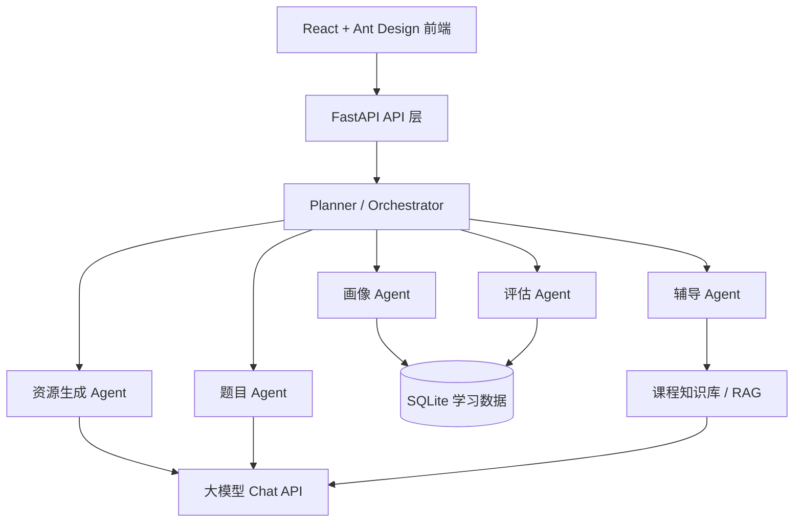

# 智学通 EduAgent

第十五届“中国软件杯”A3 赛题作品：**基于大模型的个性化资源生成与学习多智能体系统**。

智学通面向高等教育场景，以“人工智能导论”为示范课程，突出一个核心创新点：**错因驱动的个性化学习闭环**。系统先用自然语言对话构建动态学生画像，再调度多智能体生成学习资源和测评题；测评产生的错题会沉淀为错因证据，继续驱动补强资料、变式练习和学习评估更新。

## 赛题对齐

| A3 要求 | 当前实现 | 入口 |
| --- | --- | --- |
| 动态学生画像不少于 6 维 | 7 维画像：知识基础、认知风格、学习能力、易错点、学习目标、兴趣方向、学习习惯 | `/profile` |
| 多智能体协同 | Planner、Profiler、Resource、Quiz、Tutor、Evaluator 等 Agent 分工协作 | `/dashboard`、`/chat` |
| 个性化资源生成 | 读取画像和错题证据，生成课程讲解、思维导图、练习题、拓展阅读、代码案例 5 类资源 | `/resources` |
| 个性化学习路径 | 基于画像、薄弱点、测验记录和知识图谱生成推荐顺序 | `/path` |
| 学习效果评估 | 画像证据、资源证据、测验分数、学习时长、补强时间线 | `/evaluation` |
| 可演示闭环 | 学习资料生成、在线测评、自动批改、错因补强、再次测评 | `/learning` |

## 核心亮点

1. **唯一主线清晰**：首页只围绕“错因驱动的个性化学习闭环”展开，不再把功能堆成工具箱。
2. **错因驱动资源生成**：资源生成接口会读取学生画像和错题薄弱点，让资料真正贴合学生当前问题。
3. **多智能体编排**：复杂请求由 Planner 拆解，再并行调度资源、题目、代码、评估等专职 Agent。
4. **持久化错题闭环**：测验错题保存到数据库，重启后仍可继续复习、变式训练和标记掌握。
5. **证据中心**：画像、资源、图谱、错题、评估和 Agent 记录集中展示，便于评委追问时验证。
6. **本地 Mermaid 渲染**：思维导图和知识图谱不依赖 CDN，比赛现场网络不稳定也能显示。
7. **演示数据一键准备**：`/api/demo/seed` 可快速准备 7 维画像、5 类资源、学习记录、错题和示例对话。

## 快速启动

Windows 下推荐直接使用项目根目录的批处理脚本：

1. 第一次运行：双击 `首次安装依赖.bat`。
2. 以后运行：双击 `启动智学通.bat`。
3. 互相发包：双击 `打包给队友.bat`，发送生成的 `dasai-portable-*.zip`。

脚本只使用相对路径，并优先使用项目根目录里的 `.venv` 或 `.conda-env`，不要把个人电脑上的 Python 绝对路径写进项目。

如果手动启动，命令如下：

```powershell
cd path\to\dasai\eduagent\backend
..\..\.venv\Scripts\python.exe -m uvicorn app.main:app --reload --host 127.0.0.1 --port 8001

cd path\to\dasai\eduagent\frontend
npm.cmd run dev -- --host 127.0.0.1 --strictPort
```

访问：

- 前端学习闭环：http://127.0.0.1:5173/learning
- 后端健康检查：http://127.0.0.1:8001/health
- 接口文档：http://127.0.0.1:8001/docs

## 演示准备

启动前后端后，在浏览器打开 `http://127.0.0.1:5173/dashboard`，点击右上角 **准备演示数据**。

也可以直接调用：

```powershell
Invoke-RestMethod -Method Post -Uri http://127.0.0.1:8001/api/demo/seed
```

准备后应看到：

- 画像覆盖：`7/7`
- 已生成资源：至少 `5` 类，通常展示 `13` 份以上
- 学习评估：综合分约 `94`
- 补强证据：测验分数从 `72` 提升到 `88`

## 推荐答辩路线

1. 打开 `/dashboard`，只讲一句话：系统让“错因”驱动下一轮个性化资源生成。
2. 按首页的六步闭环讲：画像、规划、资源、测评、错因、评估。
3. 点击 **开始闭环演示**，展示“资料生成 - 在线测试 - 错题沉淀 - 补强再测”。
4. 打开 `/evidence`，用画像维度、错题数量、资源个性化标签、评估分数证明系统不是静态页面。
5. 打开 `/chat`，用“帮我生成神经网络学习资料和练习题”触发多智能体协作记录。

## 技术架构



## 目录结构

```text
eduagent/
├── backend/
│   ├── app/
│   │   ├── api/              # chat/profile/resource/path/graph/learning/evaluation/demo
│   │   ├── agents/           # 多智能体实现
│   │   ├── knowledge/         # 课程知识库和 RAG
│   │   ├── llm/               # 大模型 HTTP Chat API 封装
│   │   ├── models/            # SQLAlchemy 数据模型
│   │   └── main.py
│   ├── data/ai_intro/         # 人工智能导论知识库
│   ├── requirements.txt
│   └── test_self.py
└── frontend/
    ├── src/
    │   ├── components/
    │   │   └── MermaidDiagram.tsx
    │   ├── pages/
    │   │   ├── CompetitionDashboard.tsx
    │   │   ├── ChatPage.tsx
    │   │   ├── ProfilePage.tsx
    │   │   ├── ResourceCenter.tsx
    │   │   ├── KnowledgeGraphPage.tsx
    │   │   ├── LearningPage.tsx
    │   │   └── EvaluationPage.tsx
    │   └── App.tsx
    └── package.json
```

## 大模型配置

后端使用 OpenAI-compatible HTTP Chat API 形态封装，字段名保留 `SPARK_*`，方便比赛切换到科大讯飞星火开放接口。

`.env.example`：

```env
SPARK_API_KEY=your_spark_api_key_here
SPARK_HTTP_URL=https://spark-api-open.xf-yun.com/v1/chat/completions
SPARK_MODEL=x1
DATABASE_URL=sqlite+aiosqlite:///./eduagent.db
```

如果使用其他兼容接口，只需要替换 `SPARK_HTTP_URL`、`SPARK_API_KEY` 和 `SPARK_MODEL`。

## 验证命令

```powershell
cd D:\claudeprojectwenjianjia2\dasai\eduagent\backend
python -m compileall app
python test_self.py

cd D:\claudeprojectwenjianjia2\dasai\eduagent\frontend
npm.cmd run build
```

当前验证结论：

- 前端构建通过
- 后端编译通过
- 自测脚本 7/7 通过
- `/api/evaluation/report/default` 可返回画像、资源、测验、补强证据
- `/api/graph/recommend/default` 可返回画像驱动推荐路径

## 参考资料

- [第十五届“中国软件杯”成都信息工程大学校赛通知](https://www.cuit.edu.cn/info/1006/16577.htm)：公开列出 A3 赛题名称，并要求作品按全国大赛官方要求筹备。
- [第十五届“中国软件杯”大连理工大学选拔赛方案](https://chuangxin.dlut.edu.cn/info/1020/16327.htm)：公开列出 A3 赛题名称及参赛作品的软件设计要求。
- [湖州学院第十五届“中国软件杯”校级选拔赛通知](https://jwc.zjhzu.edu.cn/_t18/2026/0427/c661a41582/page.htm)：公开列出 A3 赛题名称和作品提交材料要求。
- [中国软件杯官网 A 组赛题入口](https://www.cnsoftbei.com/list-3-1.html)：赛题最终要求以官网发布为准。
